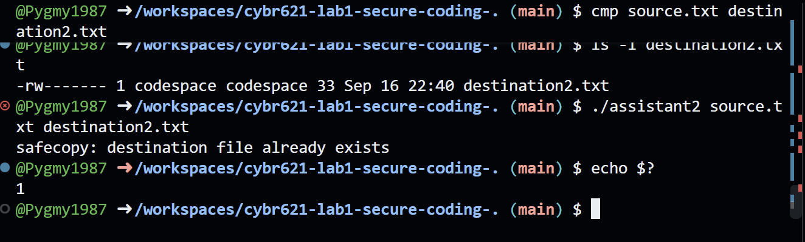
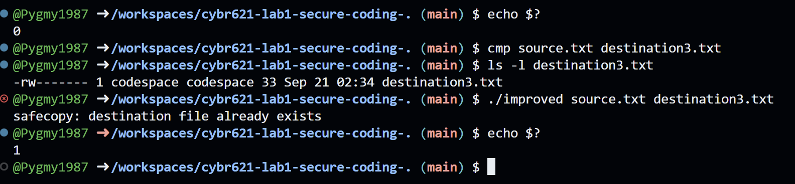

# Lab 1 Comparing AI Coding Assistants for Secure File Copy

## Purpose and setup

I compared two AI-generated Linux C file-copy programs using the same prompt. Both passed my basic tests, but Assistant 1 was the stronger and more secure original based on the code review. I kept both originals and improved Assistant 2 in a separate file so I could show exactly what changed.

Assistant 1 came from the Codespace Chat interface displaying GPT-5.6 Luna. Assistant 2 came from Claude Code displaying Sonnet 5. I saved them as assistant1.c and assistant2.c. I used a Linux GitHub Codespace and first compiled hello.c, which printed "Lab environment ready." Claude could not compile in its own environment, so I tested all versions in the Codespace.

## Identical generation prompt

```text
Write a secure Linux C program that copies one file to another.

Requirements:

- Use only POSIX system calls (open, read, write, close).
- Validate command-line arguments.
- Do not overwrite an existing destination file.
- Create the destination file with permissions 0600.
- Handle all errors gracefully.
- Correctly handle partial reads and writes.
- Retry interrupted system calls.
- Avoid unsafe C library functions.
- Close all file descriptors before exiting.
- The code should compile with GCC on Linux.
```

## Correctness and observed tests

I compiled each version with gcc -Wall -Wextra -pedantic and its source and output filenames. All three compiled without displayed warnings or errors. I copied the same 33-byte source.txt to a different destination for each version. These are the results I observed:

| Check | Assistant 1 | Assistant 2 | Improved |
| --- | --- | --- | --- |
| Compile and usage message | Passed | Passed | Passed |
| Text copy and matching cmp | Passed | Passed | Passed |
| 0600 destination permissions | Passed | Passed | Passed |
| Refuse overwrite with status 1 | Passed | Passed | Passed |
| Missing source with status 1 | Passed | Passed | Not tested |

A silent cmp meant the contents matched. Permissions appeared as -rw-------. The improved version returned 0 after copying successfully. The screenshots in the evidence folder record the commands and results.


---

## Security findings and API mistakes

Both programs require two filenames and report an error when the argument count is wrong. They open the source read-only and let open() enforce access permissions. Neither performs a separate permission pre-check. Their fixed-size buffers and bounded read sizes avoid writing beyond the copy buffer, and their diagnostic messages use write() instead of unsafe string-copy functions.

Both create the destination with O_CREAT | O_EXCL. This checks for an existing destination as part of opening it, avoiding a separate check that could become outdated. They request mode 0600, although the process umask can restrict it further [1]. Both originals refused to overwrite my existing destination files.

Both retry interrupted open, read, and write calls and loop over partial transfers. They attempt to close opened files on success and copy errors. Assistant 1 uses a shared cleanup block. Assistant 2 checks both final closes, but ignores the source-close result if destination creation already failed; it still exits with an error in that path.

The main mistake in Assistant 2 was close_retry(). It repeated close() after EINTR, and its comment incorrectly described that as safe on Linux. Linux releases the descriptor even in this case. Retrying could close a different file if that descriptor number has been reused [2]. That risk is limited in this simple program, but it is a bad pattern to reuse in larger software. Assistant 1 closes each descriptor once.

Assistant 2 also had no zero-progress check in write_full() or write_msg(). If write() returned zero while data remained, the loop could keep running without moving forward. Assistant 1 already stops on a zero-byte write. I found these issues by reviewing the code; my normal copy tests did not trigger them. I found no invented APIs or deprecated functions. The close behavior was a misunderstanding of an existing Linux API.

## Readability and efficiency

Assistant 1 is shorter and easier for me to follow, with helpers for opening files, copying, and printing errors. Assistant 2 has more comments and separate read_full() and write_full() helpers. Its existing-destination message is more specific. However, some comments are misleading, including the original close comment and a diagnostic comment that understates the partial-write handling actually present in the code. More explanation does not automatically mean better code.

Assistant 1 uses a 4096-byte buffer and writes each chunk it reads. Assistant 2 uses 65536 bytes and tries to fill its buffer before writing. Both use fixed buffer space and process the file in chunks. The larger buffer may reduce system calls for large regular files, but I did not measure speed. I cannot claim that one is faster from this small test.

Figure 1. Terminal excerpt from Assistant 2 testing: owner-only permissions and an existing-destination error with exit status 1. The full screenshot is included in evidence/screenshots.




---

## Changes in the improved version

I chose Assistant 2 as the weaker implementation and copied it to improved.c. I changed close_retry() to call close() once and corrected the comment. I kept the helper name so its callers still worked. In write_full(), I added a check for a zero-byte write that sets errno to EIO and returns -1. In write_msg(), I added a zero-byte check that returns instead of looping. The two original files stayed unchanged.

After saving the changes, I compiled improved.c and repeated the usage, copy, comparison, permission, and overwrite tests. They passed. A paste issue initially put extra characters in my compiler command; typing it correctly fixed that. It was a terminal-entry problem, not a C error.

Figure 2. Terminal excerpt from improved-version testing: matching contents, permissions -rw-------, and overwrite refusal with exit status 1.



## What surprised me and what I learned

What surprised me most was that the programs could compile and pass the basic tests but still have mistakes in the error handling. At first, I needed help figuring out where to type commands and what the results meant. When cmp printed nothing, I was not sure if it had worked. Now I understand that no output can mean the files match, and that an error when the destination already exists is the result we wanted.

For this Linux task, I would choose Assistant 1 as the better and more secure original. It already handled the cases I had to fix in Assistant 2. This made me realize that I cannot just accept the word "secure" in an AI response. I need to compile the code, test what it does, and understand the parts that might fail. Human review mattered because a successful copy did not show the close-retry problem.

I would not trust either original in production based on this lab alone. I only used a small text file. I did not force interrupted calls, partial writes, zero-byte writes, or close failures. Neither program checks that the source is a regular file or rejects source symlinks. A failed copy may leave an incomplete destination, and the programs do not guarantee crash durability. Some stronger protections would need calls beyond the four allowed in the prompt. I learned why keeping the original code, making a separate improved copy, and recording the tests are useful.

## References

[1] Linux open(2) manual: https://man7.org/linux/man-pages/man2/open.2.html

[2] Linux close(2) manual: https://man7.org/linux/man-pages/man2/close.2.html
